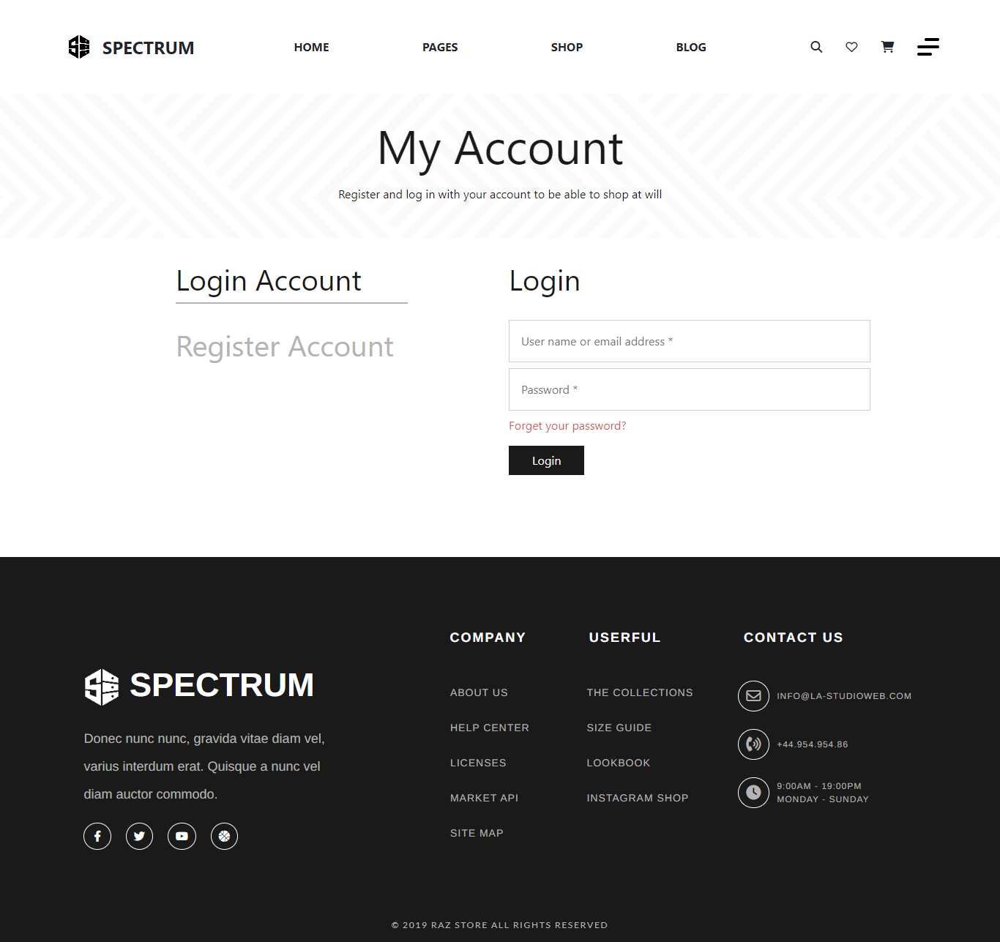
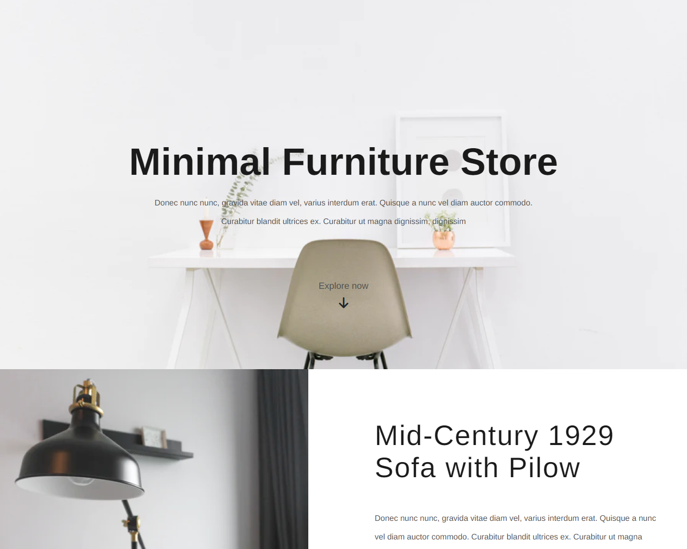

 <h1 align="center">Spectrum</h1>

  Built with NEXT JS.

## Table of Contents

- [Introduction](#introduction)
- [Features](#features)
- [Requirements](#requirements)
- [Usage](#usage-for-development)
- [Screenshots](#screenshots)
- [Contributors](#contributors)

## Introduction

<b>Spectrum</b> by Spectrum Team.
<tr>spectrum website is an e-commerce that sells some furniture for
household needs such as tables, chairs etc. The purpose of this
website is to increase sales of furniture items from every product
listed on this website</tr>
<tr>You can test the web online here: https://spectrum-react.vercel.app/</tr>

## Features

- Auth
- Product detail
- Cart
- Transactions History
- etc

## Requirements

- [`next js`](https://reactjs.org/)

## Usage for development

1. Open your terminal or command prompt
2. Type `https://github.com/mindkeeper/spectrum-react.git`
3. Open with your text editor
4. Start to edit and develop

## Screenshots

    

      
      
    

    

      
      
    

## Contributors

  <table>
    <tr>
      <td align="center">
        <a href="https://github.com/mindkeeper/spectrum-react.git">
           
          <b>Nur Cholis</b>
        </a>
        </td>
        <td align="center">
        <a href="https://github.com/mindkeeper/spectrum-react.git">
           
          <b>Zainul Rofa</b>
        </a>
        </td>
        <td align="center">
        <a href="https://github.com/mindkeeper/spectrum-react.git">
           
          <b>Farisan</b>
        </a>
        </td>
        <td align="center">
        <a href="https://github.com/mindkeeper/spectrum-react.git">
           
          <b>Rival Alfalah</b>
        </a>
        </td>
  </table>

